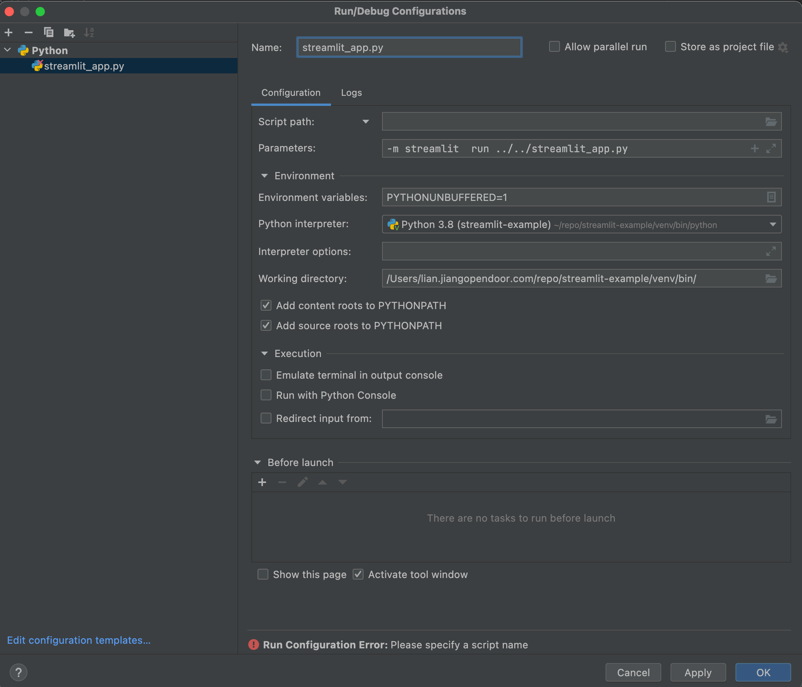

# Welcome to Streamlit!

Edit `/streamlit_app.py` to customize this app to your heart's desire. :heart:

If you have any questions, checkout our [documentation](https://docs.streamlit.io) and [community
forums](https://discuss.streamlit.io).

```angular2html
poetry init
poetry add streamlit


poetry add snowflake
poetry remove snowflake

poetry add snowflake-connector-python
```

secret.toml for snowflake connection
```angular2html
[snowflake]
user = "xxx"
password = "xxx"
account = "opendoor.us-east-1"
warehouse = "EVENT_INSTRUMENTATION_WH"
database = "DWH_DEV"
schema = "LIAN_TEST"
```

Run streamlit in pycharm
